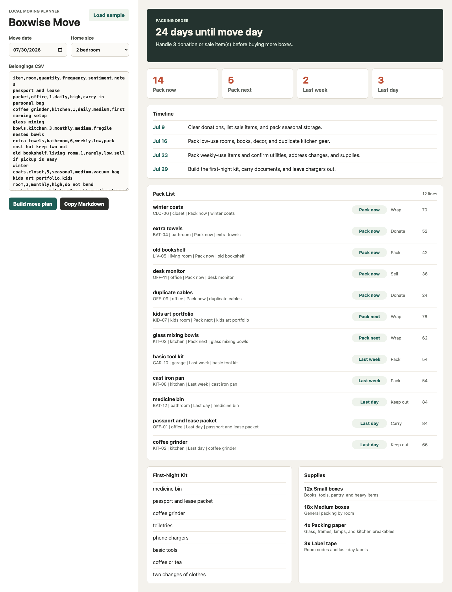

# Boxwise Move



Boxwise Move is a private moving planner for people who need more than a generic checklist. Paste a simple belongings CSV, choose a move date, and it builds a practical packing order, room labels, first-night kit, donation or sale queue, and supply estimate.

The app runs locally in your browser. Your inventory stays on your machine.

## Features

- Packing-stage planner for `Pack now`, `Pack next`, `Last week`, and `Last day`
- Local classification for fragile, essential, document, heavy, donate, and sell signals
- Label sheet with room codes for boxes and high-trust carry items
- First-night kit builder for chargers, medicine, documents, tools, and daily-use items
- Supply estimate based on home size, item count, and fragile items
- Markdown export for printing, sharing with movers, or saving in notes
- No account, cloud sync, or external API required

## Install

Requires Python 3.10 or newer.

```bash
git clone https://github.com/iwaheedsattar/boxwise-move.git
cd boxwise-move
python3 -m app.server
```

Open [http://127.0.0.1:8787](http://127.0.0.1:8787).

You can also choose a different port:

```bash
python3 -m app.server --port 8791
```

## Example Usage

1. Click `Load sample`, or paste your own CSV.
2. Set the move date and home size.
3. Click `Build move plan`.
4. Use `Copy Markdown` to copy a printable plan.

CSV format:

```csv
item,room,quantity,frequency,sentiment,notes
passport and lease packet,office,1,daily,high,carry in personal bag
glass mixing bowls,kitchen,3,monthly,medium,fragile nested bowls
old bookshelf,living room,1,rarely,low,sell if pickup is easy
medicine bin,bathroom,1,daily,high,first-night kit
```

## How It Works

Boxwise Move uses a small local planning engine:

- Parses pasted rows into household items
- Infers missing rooms from item names
- Scores category signals from item names and notes
- Assigns actions such as wrap, carry, donate, sell, keep out, or pack
- Builds a date-aware move timeline and printable labels

The goal is not to replace judgment. It gives you a clear starting order when the house is full of half-packed boxes.

## Development

Run tests:

```bash
python3 -m pytest -q
```

Run the app:

```bash
python3 -m app.server --port 8791
```

## Roadmap

- Printable label page with cut lines
- Per-room progress tracking
- Photo attachment notes for fragile boxes
- Calendar export for timeline steps
- Multi-stop move support for storage units and temporary housing

## License

MIT

